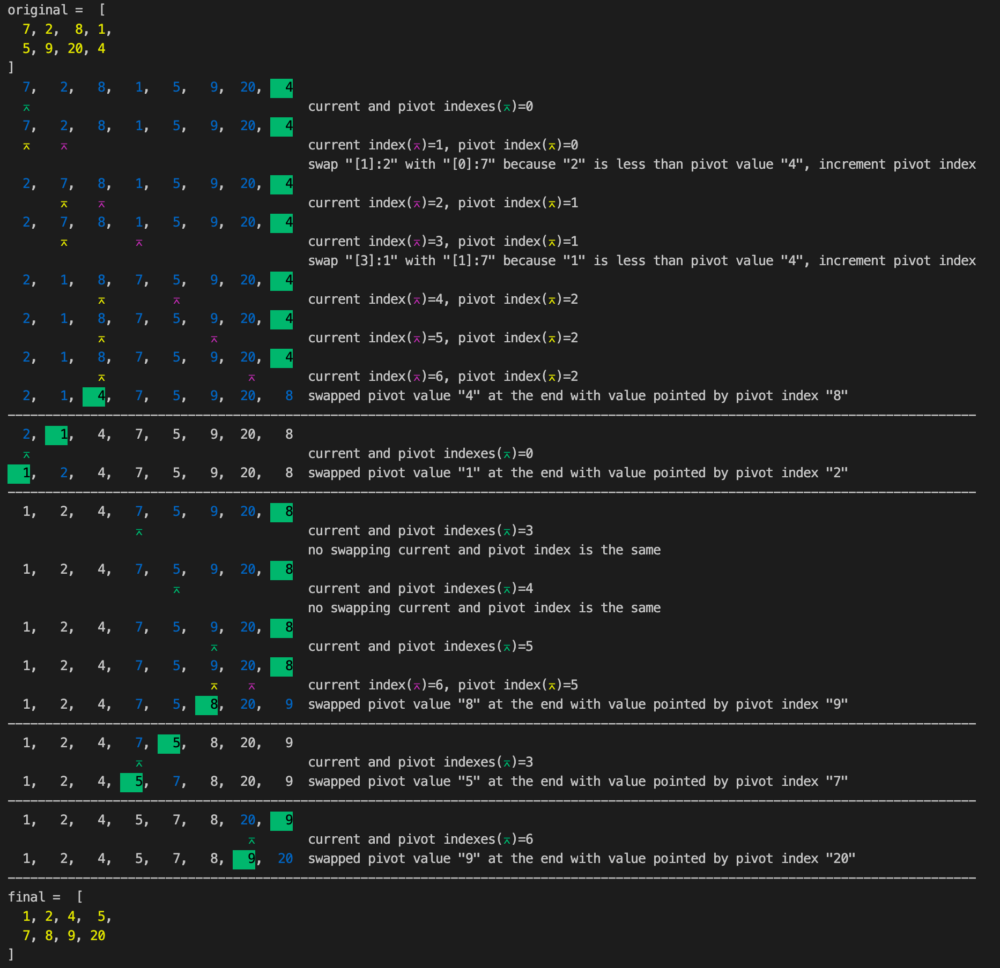

# Background

To help explain sort algorithms for VCE kids.

# Quick sort

## Partition function

Try to implement partition, a method that picks the last item in the array as a pivot and reposition the array such that all the values:

- on the left is smaller than the pivot
- on the right is larger than the pivot

### Run

```
-> node partition.js
```

### Output

```
original =  [
  7, 2,  8, 1,
  5, 9, 20, 4
]
final = 2,1,4,7,5,9,20,8, pivot index=2
```

## Divide and conquer recursively

### Run

```
-> npm i
node quicksort.js
```

### Output



# Reference

https://www.youtube.com/watch?v=eqo2LxRADhU
